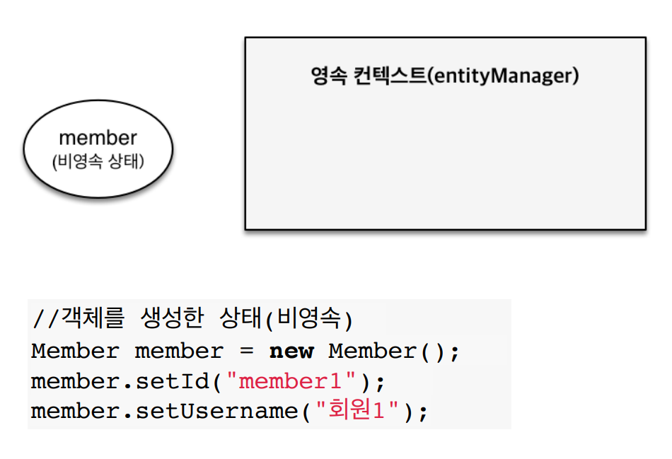

# JPA basic

-----

## JPA
- Java Persistence API
- Java 진영의 ORM 기술 표준
  - Object-Relational Mapping
  - 객체 <-> RDBMS 매핑
- 내부적으로 JDBC API를 사용하여 RDBMS와 교류

## JPA 사용하는 이유
- SQL 중심적인 개발 -> 객체 중심적인 개발
- 생산성 증대 및 유지보수
- `객체와 RMDBS의 패러다임`의 불일치 해결
- JPA의 성능최적화 기능
  - 1차 개시와 동일성 보장
    - 같은 트랙잰션 안에서는 같은 엔티티를 반환
    ```java
    Long orderId = 1107;
    Order o1 = jpa.find(Order.class, orderId); // SQL 전송
    Order o2 = jpa.find(Order.class, orderId); // caching
    // o1 == o2 true
    ```
  - 트랙잭션을 지원하는 쓰기 지연
    - 커밋 직전까지 `insert sql`를 모아두었다가 JDBC Batch SQL 기능을 사용해서 한번에 SQL 전송
    - 네트워크 통신비용이 줄어듦
  - 지연 로딩(Lazy Loading)
    

## JPA 패러다임의 불일치 해결
- `OrderMenu` 객체는 `Order`를 상속받은 상태 
1. JPA와 상속
    ```java
    // jpa
    jpa.persist(orderMenu);
    
    // query
    insert into ORDER ...;
    insert into ORDER_MENU ...;
    ```
    ```java
    // jpa
    jpa.find(OrderMenu.class, orderMenuId);
    
    // query
    select o.*, om.*
    form ORDER o
    LEFT JOIN ORDER_MENU om 
    ON o.order_menu_id = om.order_menu_id
    ```
2. JPA와 연관관계
   ```java
   order.setOrderMenu(orderMenu);
   jpa.persist(order);
   ```
3. JPA와 객체 그래프 탐색
   ```java
   Order o = jpa.find(Order.class, orderId);
   OrderMenu om = o.getOrderMenu();
   ```

----

## 영속성 컨텍스트
 `EntityManager`를 통해 영속성 컨텍스트에 접근. 엔티티를 영구 저장하는 환경

#### 영속성 컨텍스트 생명주기

- 비영속
  - 영속성 컨텍스트와 관계가 없는 새로운 상태
    

- 영속
  - 1차 캐시에 올라간 상태 
  - 영속성 컨텍스트로부터 관리되는 상태
    

- 준영속
  - `em.clear();` / `em.detach(entity);` / `em.close();` 
  - 영속성 컨텍스트에 저장되었다가 분리된 상태
    

- 삭제
  - 삭제된 상태

#### 영속성 컨텍스트의 장점
1. 1차캐시

    
    - 영속화 상태가 된 객체를 조회할 경우, 1차 캐시에 해당 객체가 있는지 조회
    - persist()로 객체를 영속화할 때, 이미 1차 캐시에 들어가기 때문에 조회 시, select 문이 발생하지 않음
    - `EntityManager`는 트랙잭션과 생명주기가 같으므로 성능에 엄청한 효과가 있는 것은 아님
2. 쓰기 지연

     
    ```java
    EntityManager em = emf.createEntityManager();
    EntityTransaction tx = em.getTransaction();
    tx.begin();
    
    // memberA 영속화
    em.persist(memberA);
    // memberB 영속화
    em.persist(memberB);
   
    // 커밋시점에 memberA, memberB Insert SQL가 생성되어 DB와 통신
    tx.commit(); 
    ``` 
3. dirty-checking

    
    - `스냅샷`을 바탕으로 객체의 변경사항을 감지하여 업데이트 쿼리를 생성
    ```java
    EntityManager em = emf.createEntityManager();
    EntityTransaction tx = em.getTransaction();
    tx.begin();
    
    // 조회
    Member m = em.find(Member.class, 1L);
   
    m.setName("mingo");
    
    // 커밋시점에 Update SQL가 생성되어 DB와 통신
    tx.commit(); 
    ``` 

#### 플러시(flush)
- 영속성 컨텍스트의 변경내용(등록, 수정, 삭제)을 DB에 반영
- 쓰기지연 저장소에 쌓아놨던 SQL이 DB에 호출되는 시점
- `영속성 컨텍스트와 DB의 싱크를 맞추는 역할`
- flush와 1차 캐시 초기화는 관계없음
- 플러시 동작 : `em.flush();` / `tx.commit();` / JPQL query 실행 시
  - JPQL query 실행 시? 
  ```java
  // A, B, C는 쓰기지연 저장소와 1차캐시에서 관리되는 상태
  // 이 데이터는 트랙잭션이 커밋되는 시점에 DB와 통신이 될 예정
  em.persist(A);
  em.persist(B);
  em.persist(C);
  
  // JPQL을 통해서 조회를 하네? -> 원래 동작이라면 실제 DB와 통신되기 전이라 조회되는 데이터가 없음
  // 이런 사항을 방지하고자 JPA는 JPQL을 사용하면 flush()를 내부에서 미리 호출함 
  q = em.createQuery("select m from Member m", Member.class);
  List<Member> m = q.getResultList();
  ```