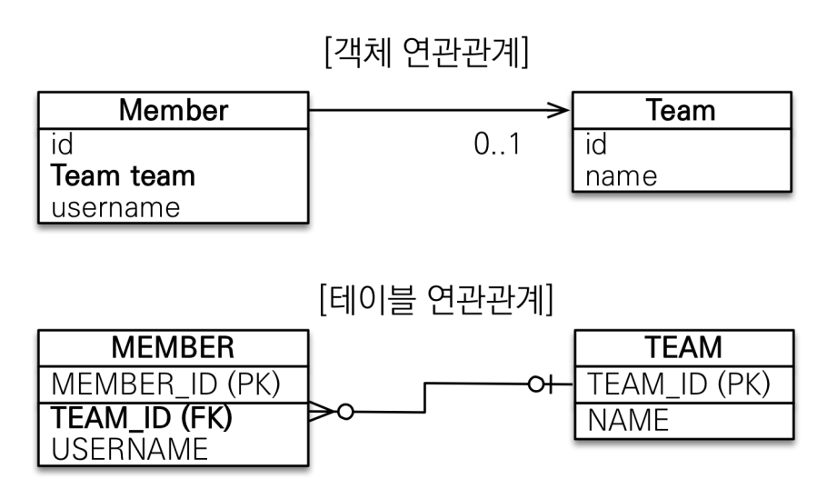
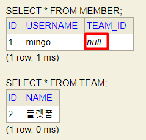

# JPA entity & 연관관계 매핑

-----

## 엔티티 
[엔티티 매핑 속성](../src/main/java/com/example/jpa/basic/entity/Member.java)

#### GenerationType.IDENTITY 전략
```java
@Entity
public class Member {
    @Id
    @GeneratedValue(strategy = GenerationType.IDENTITY)
    private Long id;
}
```
기본 키 매핑 전략 중에서 `@GeneratedValue(strategy = GenerationType.IDENTITY)` 를
사용하면 실제 RDBMS를 통해 `insert sql`이 실행되고 나서야 `id`를 확인할 수 있다.

하지만 `영속성 컨텍스트`에서 데이터가 관리되려면 `id` 값이 필수적으로 필요하다.

JPA에서는 `GenerationType.IDENTITY` 전략에서만 예외적으로 커밋 이전에 SQL를 실행시켜 해결하였다.
```java
Member member = new Member();
member.setName("member");
em.persist(member); // SQL 쿼리 실행 시점
/**
 insert into
 Member
 (id, age, createdDate, description, lastModifiedDate, roleType, name) 
 values
 (default, ?, ?, ?, ?, ?, ?)
 */
// insert 쿼리가 실행되고 해당 데이터를 select 해온 뒤에 1차 캐시에 저장해둔다.
System.out.println(member.getId()); // '1' 출력 됨 (DB에서 select 해왔기 때문)
tx.commit();
```

#### GenerationType.SEQUENCE 전략

```java
@SequenceGenerator(
        name = "MEMBER_SEQ_GENERATOR",
        sequenceName = "MEMBER_SEQ", //매핑할 데이터베이스 시퀀스 이름
        initialValue = 1, allocationSize = 50) // allocationSize 성능 최적화
@Entity
public class Member {
    @Id
    @GeneratedValue(strategy = GenerationType.SEQUENCE, generator = "MEMBER_SEQ_GENERATOR")
    private Long id;
}
```
`GenerationType.SEQUENCE` 전략에서 `allocationSize` 옵션을 통해 네트워크 통신비용을 줄일 수 있다.
`allocationSize` 옵션은 default 50으로 설정되어 있고 한번에 시퀀스 50개를 로컬로 가져와서 하나씩 소비하는 방식이다.
동시성 이슈없이 최적화된 옵션이므로 오라클 DB를 사용하면 유용하게 사용할 수 있음

-----

## 연관관계 매핑
> 객체와 테이블 연관관계의 차이를 이해하고 객체의 `참조`와 테이블의 `FK`를 매핑하는 것이 핵심

#### 객체를 테이블에 맞춘 설계의 문제점
```java
// =========== 등록 ============
Team team = new Team();
team.setName("TeamA");
// team 영속화 & 저장
em.persist(team);

Member member = new Member();
member.setName("member1");
member.setTeamId(team.getId()); // team 객체의 참조가 아닌 teamId를 넣음
// member 영속화 & 저장
em.persist(member);


// =========== 조회 ============
Member findMember = em.find(Member.class, member.getId());
Long teamId = findMember.getTeamId();
Team findTeam = em.find(Team.class, teamId);
```

- 객체를 테이블에 맞춰 데이터 중심으로 모델링하면 객체 간 협력관계를 만들 수 없음
- FK를 사용해서 여러번 쿼리를 수행해야 함

#### 단방향 연관관계
- 맴버 → 팀
  

#### 양방향 연관관계
- 맴버 → 팀
- 맴버 ← 팀
  

- 테이블은 방향 개념이 없고 FK 하나로 양쪽 테이블 탐색이 가능
- 객체에서 양쪽 객체 모두를 탐색하려면 `필드(members)`가 필요함
- `@OneToMany(mappedBy = "team")` 애노테이션이 중요함

> `@OneToMany(mappedBy = "team")` <br>
    객체의 연관관계는 2개 <br>
     - 맴버 → 팀 1개의 단방향 <br>
     - 맴버 ← 팀 1개의 단방향 <br>
    테이블의 연관관계 1개 <br>
     - 맴버 ↔ 팀 1개의 양방향 <br> 

객체를 양방향으로 참조하려면 단방향 연관관계를 2개 만들어야 함
```java
class A {
    B b;
}

class B {
    A a;
}

// A → B
a.getB();
// B → A
b.getA();
```

단방향 2개를 가지고 있는 객체 입장에서 팀을 바꾼다고 가정하면
 - 맴버 객체의 팀을 수정할 지
 - 팀 객체의 맴버를 수정할 지

선택하기 어려움.. → 양방향(단방향 2개) **연관관계의 주인**을 정해주자


**연관관계의 주인**
- 객체의 두 관계중 하나를 연관관계의 주인으로 지정
- 연관관계의 주인쪽에서 FK를 관리(등록, 수정)
- 연관관계의 주인이 아닌 쪽은 read-only / mappedBy 설정으로 주인을 Following
- DB의 FK가 존재하는 테이블이 주인

**연관관계 자주하는 실수**
```java
Member member = new Member();
member.setName("mingo");
em.persist(member);

Team team = new Team();
team.setName("플랫폼");
// team의 members 필드는 연관관계의 주인이 아니다!!!
team.getMembers().add(member);
em.persist(team);


em.flush();
em.clear();
```


연관관계 주인이 아닌 team의 members 필드에게 데이터를 넣어도 실제 데이터 insert가 수행되지 않으므로 DB의 TEAM_ID는 null인 것을 확인할 수 있음

**연관관계의 값 설정**
- 연관관계 주인 / 연관관계 주인 팔로워 모두 값 설정을 해주자
  1. 연관관계 주인쪽만 값 설정을 해주어도 되지만 헷갈림 방지
  2. 연관관계 주인쪽만 해주었을 때, flush()가 발생하지 않은 동일한 트랙잭션 내 조회가 또 발생하였다고 가정하면 이슈가 발생함
     ```java
     Team team = new Team();
     team.setName("플랫폼");
     em.persist(team);

     Member member = new Member();
     member.setName("mingo");
     member.setTeam(team);
     em.persist(member);

     // em.flush();
     // em.clear();
     
     // 조회 발생 !!! 1차 캐시에서 데이터를 그대로 가져옴 -> 당연히 team에 members는 비어 있음
     Team findTeam = em.find(Team.class, team.getId());
     List<Member> members = findTeam.getMembers();
     members.forEach(s -> {
        System.out.println("맴버명단 :" + s);
     });   
     ```
  3. 객체지향적인 관점에서 봤을 때 양쪽 모두 값을 설정하는 것이 바람직함

#### 단방향, 양방향
- 테이블
  - pk 하나로 양쪽 조인 가능
  - 사실 방향 개념 X
- 객체
  - 참조용 필드가 있는 쪽으로만 참조 가능
  - 한쪽만 참조하면 단방향
  - 양쪽이 서로 참조하면 양방향
  - 양방향의 경우, 참조 2군데 중 어느쪽에서 pk를 관리할 지 지정해 주어야 함 (연관관계 주인 설정)
    - 연관관계 주인 : pk를 관리하는 참조
    - 연관관계 팔로워 : pk에 영향을 주지 않고 read-only