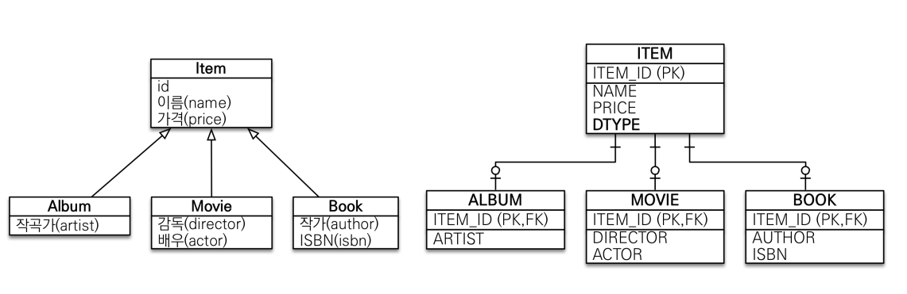
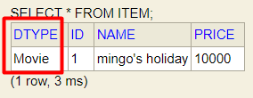
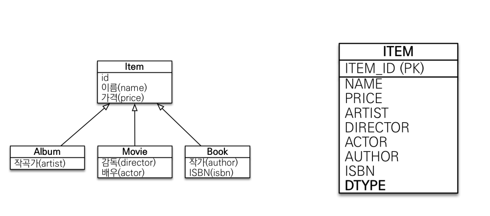
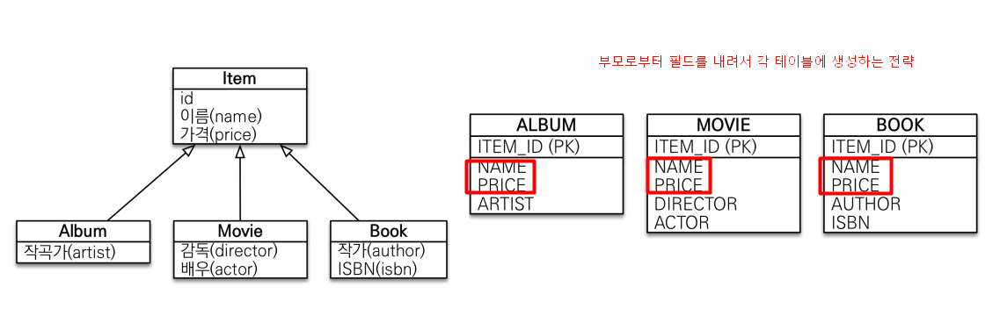
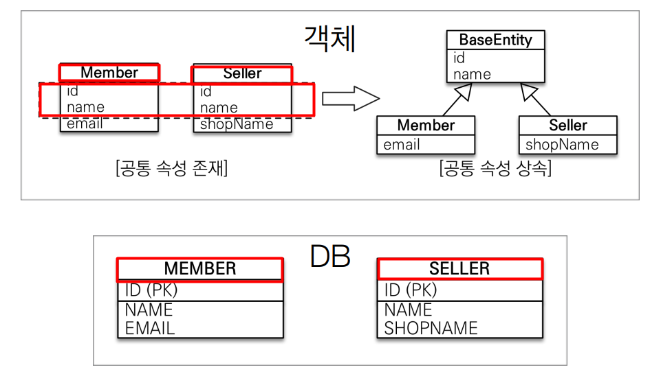

# JPA 상속관계 매핑

-----

[Entity](../src/main/java/com/example/jpa/shop/domain/level3)

[TEST](../src/main/java/com/example/jpa/basic/InheritanceMain.java)

**@Inheritance(InheritanceType = InheritanceType.?)**
 - 1. JOIND : 조인 전략
 - 2. SINGLE : 단일테이블 전략
 - 3. TABLE_PER_CLASS : 구현 클래스마다 테이블 생성 전략
   
```java
// 부모
public class Item {
    @Id
    @GeneratedValue
    private Long id;
    private String name;
    private int price;
}

// 자식1
@Entity
public class Album extends Item {
    private String artist;
}
// 자식2
@Entity
public class Movie extends Item {
    private String director;
    private String actor;
}
// 자식3
@Entity
public class Book extends Item {
    private String author;
    private String isbn;

}
```

위와 같이 Entity를 만들고 테이블 생성 쿼리를 확인하면,
```bigquery
create table Item (
   DTYPE varchar(31) not null,
    id bigint not null,
    name varchar(255),
    price integer not null,
    artist varchar(255),
    actor varchar(255),
    director varchar(255),
    author varchar(255),
    isbn varchar(255),
    primary key (id)
)
```
기본적으로 JPA가 선택하는 상속전략은 `SINGLE_TABLE(단일테이블)` 전략인 것을 확인할 수 있음

#### 1. 조인 전략



```java
// 조인 전략
@Entity
@Inheritance(strategy = InheritanceType.JOINED)
public class Item {
    ...
}
```
```bigquery
create table Album (
    artist varchar(255),
    id bigint not null,
    primary key (id)
)

create table Item (
    id bigint not null,
    name varchar(255),
    price integer not null,
    primary key (id)
)

alter table Album add constraint FKcve1ph6vw9ihye8rbk26h5jm9 
   foreign key (id) references Item
```

부모 클래스에 `@DiscriminatorColumn` 를 넣어주면 `DTYPE` 컬럼이 생기고
자식을 구분할 수 있는 데이터(자식 클래스의 클래스명 : Album, Movie, Book)가 들어가게 된다.



- `DTYPE` 컬럼명은 부모 클래스의  `@DiscriminatorColumn` 의 name 속성으로 컬럼명을 바꿀 수 있음
- 컬럼에 들어가는 value는 자식 클래스에 `@DiscriminatorValue` 의 name 속성으로 설정할 수 있음

#### 2. 단일 테이블 전략



```java
// 단일 테이블 전략
@Entity
@Inheritance(strategy = InheritanceType.SINGLE_TABLE)
public class Item {
...
}
```

- 조인 전략과 달리 `@DiscriminatorColumn` 애노테이션이 부모 클래스에 없어도 무조건 `DTYPE` 컬럼이 생성됨

```bigquery
create table Item (
    DTYPE varchar(31) not null,
    id bigint not null,
    name varchar(255),
    price integer not null,
    artist varchar(255),
    actor varchar(255),
    director varchar(255),
    author varchar(255),
    isbn varchar(255),
    primary key (id)
)
```

#### 3. 구현 클래스마다 테이블 생성 전략



```java
// 구현 클래스마다 테이블 생성 전략
@Entity
@Inheritance(strategy = InheritanceType.TABLE_PER_CLASS)
public abstract class Item {
...
}
```

```bigquery
create table Album (
    id bigint not null,
    name varchar(255),
    price integer not null,
    artist varchar(255),
    primary key (id)
)
create table Book (
    id bigint not null,
    name varchar(255),
    price integer not null,
    author varchar(255),
    isbn varchar(255),
    primary key (id)
)
create table Movie (
    id bigint not null,
    name varchar(255),
    price integer not null,
    actor varchar(255),
    director varchar(255),
    primary key (id)
)
```
- 테이블이 각각 분리되었기에 `@DiscriminatorColumn`는 무시됨
- 부모 클래스인 Item에 대한 테이블은 존재 X
  - Item을 조회하게 되면 상속받은 모든 테이블을 union하는 쿼리가 날아감... ㅠㅠ

-----

#### @MappedSuperclass



> DB와는 상관없이 공통되는 필드를 따로 사용하고 싶을 때 사용. 엔티티가 아니다.

```java
@MappedSuperclass
public abstract class BaseEntity {

    private String createdBy;
    private LocalDateTime createdDate;
    private String lastModifiedBy;
    private LocalDateTime lastModifiedDate;

}

@Entity
@Inheritance(strategy = InheritanceType.TABLE_PER_CLASS) // 구현 클래스마다 테이블 생성 전략
public abstract class Item extends BaseEntity {
  ...
}
```
