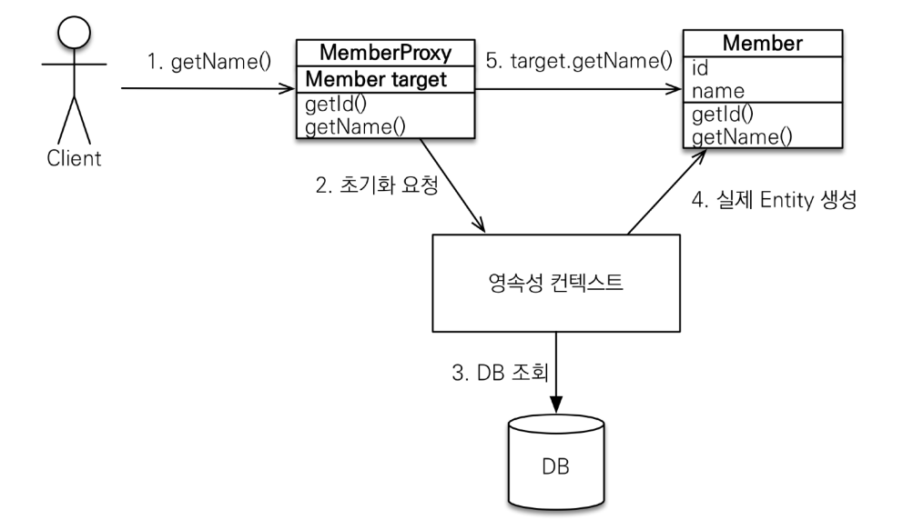
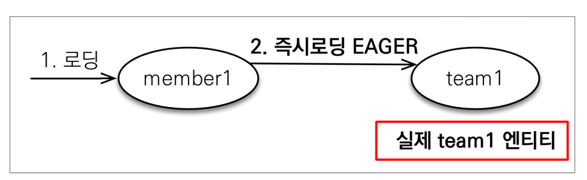
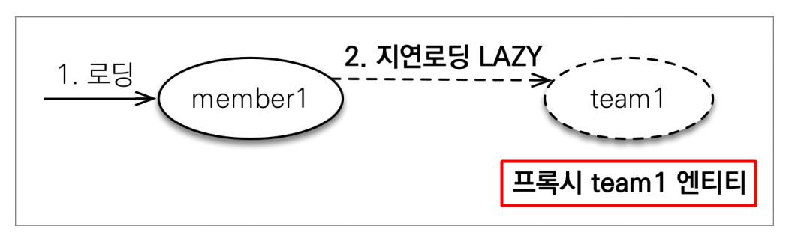
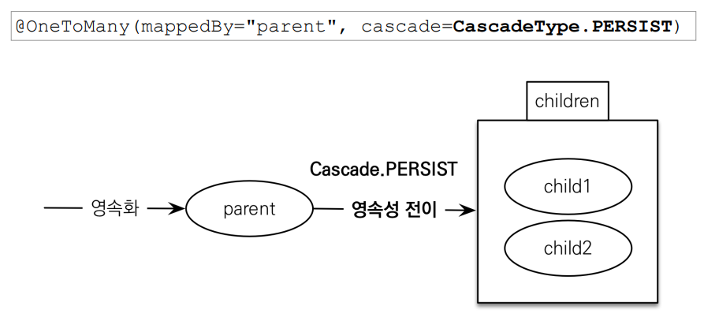

# JPA Proxy와 즉시로딩, 지연로딩, CASCADE

-----

## Proxy

[TEST](../src/main/java/com/example/jpa/basic/ProxyMain.java)

- `em.getReference()`
- DB에 조회를 미루고 우선 Proxy(가짜) 엔티티 객체를 조회한 뒤, 참조를 사용하는 순간 실제 DB에 SQL이 나감

```java
Member member = new Member();
member.setName("hello");

em.persist(member);

em.flush();
em.clear();

// getReference() 메서드를 호출하는 시점에는 SQL이 안나감
Member referenceMember = em.getReference(Member.class, member.getId());

// referenceMember.class = class com.example.jpa.shop.domain.level1.Member$HibernateProxy$n3hb6vEr
System.out.println("referenceMember.class = " + referenceMember.getClass());
// getId()는 DB를 안찾아가도 알 수 있는 정보
System.out.println("referenceMember.id = " + referenceMember.getId());

// !!! 실제 호출 !!! DB에 접근하지 않고서는 알 수 없는 데이터(name)를 사용할 때, SQL이 실행됨
System.out.println("referenceMember.name = " + referenceMember.getName());
```


 - 참조필드의 getClass() 시, `Member$HibernateProxy$n3hb6vEr` 맴버 Proxy 객체를 확인
 - Proxy 객체는 실제 클래스를 상속받아서 만들어짐
 - Proxy 객체는 실제 객체의 참조(target)를 보관하고 있고 사용자가 실제 객체를 호출하면 보관되어 있는 참조를 통해 실제 객체의 메소드를 호출
 - 참조가 비어있다면 `영속성 컨텍스트`에 초기화 요청을 하고 그 결과는 1차 캐시와 실제 객체에 담겨짐
 - Proxy 객체는 처음 사용될 때 한 번만 초기화
 - 실제 객체가 초기화가 되어도 참조가 바뀌는 것이 아니라 Proxy 객체를 통해 실제 객체에 접근하는 방식
 - 단, 이미 `영속성 컨택스트`에 찾으려는 엔티티가 보관되어 있다면 `getReference()`를 통해 Proxy 객체를 만드려고 시도해도 실제 객체가 반환된다. (굳이 1차 캐시에 있는 데이터를 가짜 객체를 통해 접근할 필요가 없으니깐)
 - `영속성 컨텍스트`의 도움을 받을 수 없는 준영속 상태일 때, 프록시를 초기화 요청하면 exception 발생
    ```java
    public void methodA() {
        Member member = methodB(...)
        
        // org.hibernate.LazyInitializationException 발생
        String teamName = member.getTeam().getName();
    }
    
    @Transactional
    public Member methodB(...) {
        ...
        Member member = em.find(Member.class, id);
        ...
        return member;
    }
    ```

-----

## 즉시로딩과 지연로딩

[TEST](../src/main/java/com/example/jpa/basic/LazyAndEagerMain.java)

 - Proxy 기술을 사용
 - 객체안에 참조객체가 있는 경우, 참조 객체를 로딩하는 시점을 옵션으로 선택할 수 있음
 - Eager(즉시 로딩), Lazy(지연 로딩)

```java
@Entity
public class Member {

    @Id
    @GeneratedValue
    private Long id;

    @Column(name = "USERNAME")
    private String name;

    // fetch 옵션을 통해 즉시로딩, 지연로딩 설정 가능
    @ManyToOne(fetch = FetchType.LAZY)
    @JoinColumn(name = "TEAM_ID")
    private Team team;

}
```
 - FetchType.EAGER(즉시로딩) - 참조되어 있는 team이 EAGER 설정일 경우
   
   - `Member` 엔티티를 조회할 때, member와 team의 join 쿼리가 `조회 시점`에 수행됨
   - member는 물론 team도 실제 객체가 담겨짐
 - FetchType.LAZY(지연로딩) - 참조되어 있는 team이 LAZY 설정일 경우
   
    - `Member` 엔티티를 조회할 때, member 단독 쿼리가 수행됨
    - member는 실제 객체지만 team은 Proxy 객체가 담겨짐
    - 트랙잭션 스코프 내에서 `member.getTeam().getName()` 등등 team 참조값에 접근하면(== `사용 시점`) `영속성 컨텍스트`를 통해 team 객체를 초기화하고 team 쿼리가 단독으로 수행됨

#### 즉시로딩의 주의점

- 여러 테이블이 JOIN 되어 쿼리가 수행되기 때문에, 개발자가 생각하지 못한 쿼리 발생 가능성 많음
- JPQL에서 N+1 문제 발생
  - [TEST](../src/main/java/com/example/jpa/basic/LazyAndEagerMain.java)
- @ManyToOne, @OneToOne : default 즉시로딩
- @OnToMany, @ManyToMany : default 지연로딩

-----

[TEST](../src/main/java/com/example/jpa/basic/CascadeMain.java)
[Entity](../src/main/java/com/example/jpa/shop/domain/level4)

#### 영속성 전이 : CASCADE



 - @OneToMany 옵션 `cascade = CascadeType.ALL`
 - persist()의 연쇄작용 = 영속성 전이
 - 특정 엔티티를 영속화 상태로 만들 때, 연관된 엔티티도 함께 영속화 상태로 만들고 싶을 때 사용
 - 단일 엔티티에 종속적인 경우에만 사용하는 것이 좋음

#### 고아 객체

 - @OneToMany 옵션 : `orphanRemoval = true`
 - 고아객체 제거 : 연관관계가 끊어진 자식 엔티티를 자동으로 삭제 / 참조가 제외된 엔티티 삭제
 - 단일 엔티티에 종속적인 경우에만 사용하는 것이 좋음
 - 개념적으로 부모를 제거하면 자식은 고아가 된다. 따라서 고아 객체 제거 기능을 활성화 하면, 부모를 제거할 때 자식도 함께 제거된다. 이것은 `CascadeType.REMOVE`처럼 동작한다.

**CascadeType.ALL + orphanRemoval=true**

> 위 옵션을 통해 부모 엔티티를 통해 연관관계의 자식 엔티티의 생명주기를 모두 관리 할 수 있고 이것은 도메인 주도 설계(DDD)의 Aggregate Root 개념